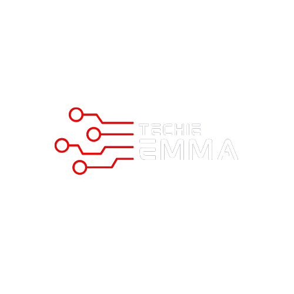
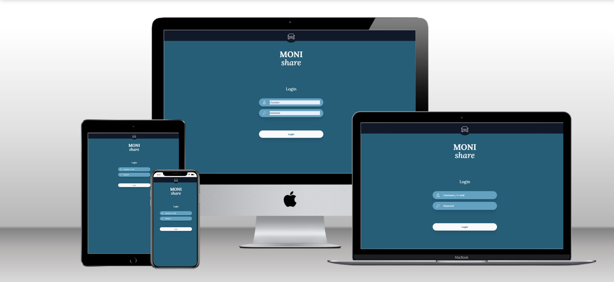

<a name="readme-top"></a>

<!-- PROJECT LOGO -->
<br />
<div align="center">
  <a href="https://buggo.vercel.app/">
    
  </a>

  <h5 align="center">
    <br />
    <a href="https://techieemma.me/" target="_blank">View Live</a>
    |
    <a href="https://github.com/nickemma/portfolio-v2/issues/new" target="_blank">Report Bug</a>
    |
    <a href="https://github.com/nickemma/portfolio-v2/issues/new" target="_blank">Request Feature</a>
  </h5>
</div>

<!-- TABLE OF CONTENTS -->
<details>
  <summary>Table of Contents</summary>
  <ol>
    <li>
      <a href="#portfolio">Personal Website</a>
      <ul>
        <li><a href="#live-link">Live Link</a></li>
        <li><a href="#built-with">Built With</a></li>
      </ul>
    </li>
    <li>
      <a href="#getting-started">Getting Started</a>
      <ul>
        <li><a href="#clone-locally">Clone Locally</a></li>
        <li><a href="#prerequisites">Prerequisites</a></li>
        <li><a href="#development">Development</a></li>
      </ul>
    </li>
    <li><a href="#contributing">Contributing</a></li>
    <li><a href="#license">License</a></li>
    <li><a href="#contact">Contact</a></li>
    <li><a href="#acknowledgments">Acknowledgments</a></li>
  </ol>
</details>

<!-- ABOUT THE PROJECT -->

### About My Portfolio

This website serves as a collection of my most recent, expertly crafted, and innovative projects as well as a base of knowledge concerning the about of the creator... Nicholas Emmanuel.

<div align="center">
  
</div>

#### Built With

**Main Technologies:**

- 
- 
- 

<p align="right">(<a href="#readme-top">back to top</a>)</p>

---

<!-- GETTING STARTED -->

### Getting Started

#### Clone Locally

- Enter this url: [https://github.com/nickemma/portfolio-v2](https://github.com/nickemma/portfolio-v2) in your web browser.
- Once opened navigate to the top left level of the project a green code download button will be visible on the righthand side.
- Select download Zip option from drop down menu.
- Once the download is complete you will be able to access my project locally.

#### Prerequisites

- Node package manager (latest version)

  - Firstly install **node runtime environment (node.js)** then run the code below

  ```sh
  npm install npm@latest -g
  ```

  - Then install yarn **yarn** or **npm**

  ```sh
  npm install --global yarn or npm
  ```

- Project dependencies
  - Change to the client directory and install all packages with npm
    from **.**
    ```sh
    cd portfolio-v2
    npm install
    ```

#### Development

- Run the app
  - Change to the directory and run the code below
    from **_portfolio-v2_**
    ```sh
    cd portfolio-v2
    npm run dev
    ```

<p align="right">(<a href="#readme-top">back to top</a>)</p>

---

<!-- CONTRIBUTING -->

### Contributing

Contributions are what make the open source community such an amazing place to learn, inspire, and create. Any contributions you make are **greatly appreciated**.

If you have a suggestion that would make this better, please fork the repo and create a pull request. You can also simply open an issue with the tag "enhancement".
Don't forget to give the project a star! Thanks again!

1. Fork the Project
2. Create your Feature Branch (`git checkout -b feature/AmazingFeature`)
3. Commit your Changes (`git commit -m 'Add some AmazingFeature'`)
4. Push to the Branch (`git push origin feature/AmazingFeature`)
5. Open a Pull Request

<p align="right">(<a href="#readme-top">back to top</a>)</p>

---

<!-- LICENSE -->

### License

Please be advised that our project is released under the terms of a License. Please ensure that you read and understand the terms of the [MIT](LICENSE) License before using our project.

<p align="right">(<a href="#readme-top">back to top</a>)</p>

---

<!-- CONTACT -->

### Contact

#### Nicholas Emmanuel

 <div align="center">
 <a href="https://www.linkedin.com/in/techieemma/"></a> 
 <a href="https://twitter.com/techieEmma"></a> 
 <a href="https://github.com/nickemma/"></a> 
 <a href="https://angel.co/u/techieemma"></a> 
 <a href="mailto:nicholasemmanuel321@gmail.com"></a>
 </div>

<p align="right">(<a href="#readme-top">back to top</a>)</p>

---

<!-- ACKNOWLEDGMENTS -->

## Acknowledgments

- [Partner](https://charlottedivine.netlify.app/) for the UI design inspiration for this project.
- [LazyCoders](https://lazy-coders.netlify.app/) For help and support throughout my development journey

<p align="right">(<a href="#readme-top">back to top</a>)</p>
